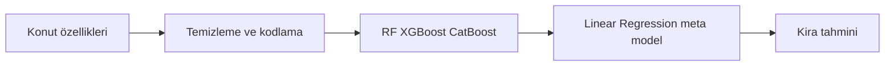

<div align="center">

# İstanbul Kira Tahmini

### İstanbul konut verilerinden kira tahminine.


[](LICENSE)

İstanbul kiralık konut verilerinden kira fiyatını tahmin etmek için farklı regresyon modellerini birleştiren tahmin uygulaması.

**Konut verileriyle regresyon analizi**

[Projeyi keşfet](https://github.com/silanpehlivan/KiraTahmini_Projesi/tree/main) · [Kurulum ve ayrıntılar](#projeyi-çalıştırmak-ve-incelemek)

</div>

---

## İçeride neler var?

- **01** · Random Forest, XGBoost ve CatBoost modelleri
- **02** · Linear Regression ile stacking yaklaşımı
- **03** · Alan, konum ve bina özelliklerine dayalı tahmin

## Projeyi çalıştırmak ve incelemek

<details>
<summary><strong>Kurulum, kod yapısı ve teknik notları aç</strong></summary>

## Öne Çıkanlar

- Random Forest, XGBoost ve CatBoost modelleri
- Linear Regression ile stacking yaklaşımı
- Alan, konum ve bina özelliklerine dayalı tahmin

## Teknolojiler

Python · FastAPI · Stacking

### Teknik yaklaşım

Eksik/tekrarlı kayıt ve uç değer temizliği sonrası konum kodlanır. Random Forest, XGBoost ve CatBoost tahminleri Linear Regression meta modeliyle birleştirilir; R² ve MAE hesaplanır.



### Kodu incelemeye başlayın

- [KiraTahmini_Projesi/train_model.py](KiraTahmini_Projesi/train_model.py)
- [KiraTahmini_Projesi/main.py](KiraTahmini_Projesi/main.py)
- [KiraTahmini_Projesi/static/index.html](KiraTahmini_Projesi/static/index.html)

### Kapsam ve sınırlar

R²/MAE eğitim betiğinde hesaplanır; burada yeni deney sonucu üretilmemiştir. Zaman ve konum dağılımındaki değişimler tahmini etkiler.


Bu proje, İstanbul’daki kiralık konut verileri kullanılarak makine öğrenmesi teknikleri ile kira fiyatlarının tahmin edilmesini amaçlamaktadır.  
Çalışma, Bitlis Eren Üniversitesi kapsamında Şilan Pehlivan ve Sevgi Golgiyaz tarafından hazırlanmış bir Makine Öğrenmesi proje raporu çerçevesinde geliştirilmiştir.

---

 Proje Hakkında
---

İstanbul gibi büyük ve değişken bir konut piyasasında doğru kira tahmini yapmak; kiracılar için adil fiyatlandırma, ev sahipleri için gerçekçi değerleme ve genel piyasa analizi için veri temelli karar desteği sağlamaktadır.

Bu çalışmada, doğrusal olmayan ilişkileri modelleyebilen gelişmiş makine öğrenmesi algoritmaları kullanılmıştır.

---

 Kullanılan Teknolojiler ve Model Mimarisi
---

Projede temel olarak **Stacking Regressor (Yığınlama Regresyonu)** mimarisi kullanılmıştır.

### Base Learners (Temel Modeller)

- Random Forest Regressor  
- XGBoost Regressor  
- CatBoost Regressor  

### Meta Learner (Üst Model)

- Linear Regression  

Temel modellerin çıktıları birleştirilerek nihai kira tahmini üretilmiştir.

---

### Web Arayüzü
---

- FastAPI  

Eğitilen modelin kullanıcıya sunulması için API tabanlı bir web servisi geliştirilmiştir.

---

 Model Performansı
---

Deneyler sonucunda stacking yaklaşımının tekil modellere göre daha başarılı olduğu gözlemlenmiştir.

| Model              | R² Skoru | MAE |
|-------------------|----------|------|
| Random Forest      | 0.33     | 1.017 |
| XGBoost            | 0.36     | 1.216 |
| CatBoost           | 0.37     | 1.416 |
| Stacking Regressor | 0.40     | 1.616 |

 Genel model başarısı: %86

---

 Önemli Bulgular
---

Model analizlerine göre kira fiyatlarını en çok etkileyen faktörler:

- **Alan (m²):** En güçlü belirleyici faktördür  
- **Konum (İlçe / Mahalle):** Fiyat üzerinde doğrudan etkilidir  
- **Bina Yaşı:** Yapının durumu fiyatı önemli ölçüde etkiler  

---

 Veri Seti
---

Toplam **11.627 kayıt** kullanılmıştır.

### Girdi Özellikleri

- İlçe (District)  
- Mahalle (Neighborhood)  
- Oda Sayısı  
- Salon Sayısı  
- Metrekare (Area)  
- Bina Yaşı  
- Kat Bilgisi  

### Hedef Değişken
---

- Kira Fiyatı (Price)

---

 Proje Yapısı
---

```
├── main.py              # FastAPI uygulaması
├── train_model.py       # Model eğitimi
├── static/              # Web arayüz dosyaları
└── README.md
```

---

 Model Eğitimi

```bash
python train_model.py
```

---

 Uygulamayı Çalıştırma

```bash
uvicorn main:app --reload
```

---

 Akademik Not
---

Bu çalışma, Bitlis Eren Üniversitesi kapsamında eğitim ve araştırma amaçlı olarak hazırlanmıştır.

---


---


</details>

---

<div align="center">

**© 2026 Şilan PEHLİVAN and Sevgi GOLGİYAZ**

Bu proje MIT lisansı kapsamında sunulmaktadır. Kullanım ve dağıtım koşulları: [LICENSE](LICENSE).

</div>
